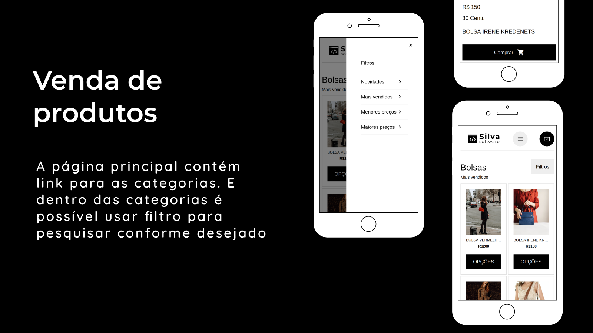
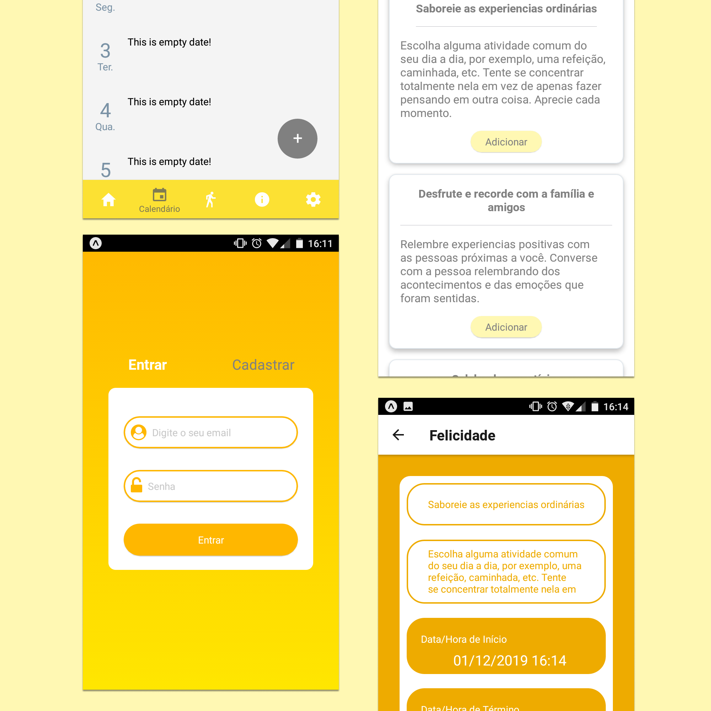

<header>
<link rel="stylesheet" href="index.css">

</header>

### Hi there 👋

Meu nome é Anderson, sou desenvolvedor full stack do Brasil. Procuro uma vaga remota, meu nível de inglês é X. Programando desde 2016

<h3>Contact</h3>

 

<h3>Languages</h3>

</img>

<h3>Front end</h3>

 
 

<h3>Back end</h3>

 
 

 
 
<h3>Open source projects</h3>
 

  

| Project 	| Preview 	|
|-	|-	|
| :brazil: Um E-commerce serverless com API Graphql gerado pelo AWS  Amplify. Utilizando a Baseweb UI, usada pela a equipe Uber.   :us: A serverless E-commerce with API Graphql generated by AWS Amplify. Using the Baseweb UI, created by the Uber team. 
       	| 
 	|

 
 

  

| Project 	| Preview 	|
|-	|-	|
| :brazil: Um E-commerce serverless com API Graphql gerado pelo AWS  Amplify. Utilizando a Baseweb UI, usada pela a equipe Uber.   :us: A serverless E-commerce with API Graphql generated by AWS Amplify. Using the Baseweb UI, created by the Uber team. 
   	| 
 	|

 
 

  

| Project 	| Preview 	|
|-	|-	|
| :brazil: Um E-commerce serverless com API Graphql gerado pelo AWS  Amplify. Utilizando a Baseweb UI, usada pela a equipe Uber.   :us: A serverless E-commerce with API Graphql generated by AWS Amplify. Using the Baseweb UI, created by the Uber team. 
    	| 
 	|

<!--
**andersonms1/andersonms1** is a ✨ _special_ ✨ repository because its `README.md` (this file) appears on your GitHub profile.

Here are some ideas to get you started:

- 🔭 I’m currently working on ...
- 🌱 I’m currently learning ...
- 👯 I’m looking to collaborate on ...
- 🤔 I’m looking for help with ...
- 💬 Ask me about ...
- 📫 How to reach me: ...
- 😄 Pronouns: ...
- ⚡ Fun fact: ...
-->
