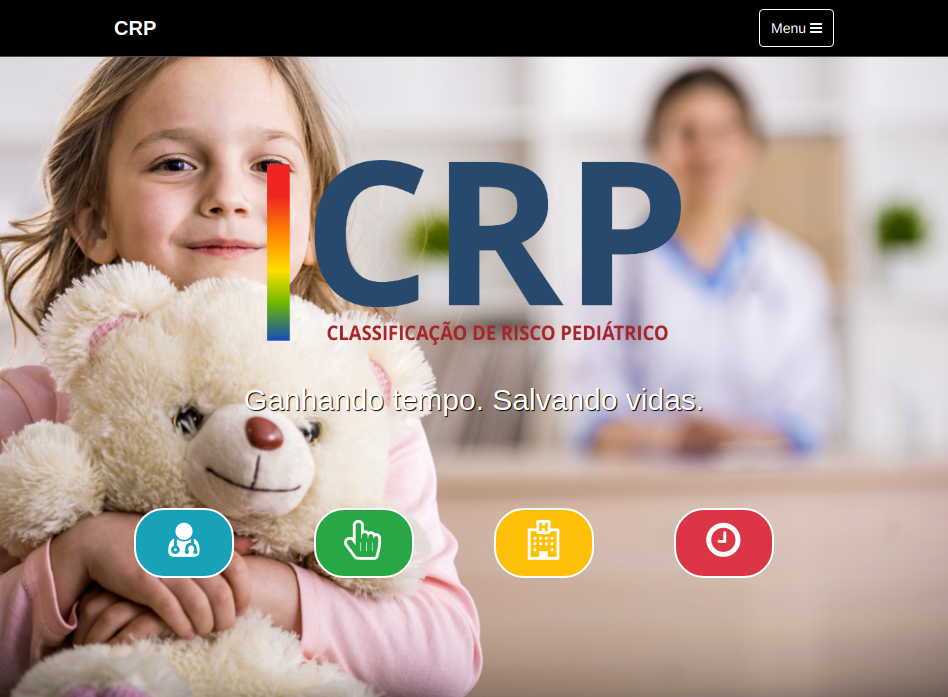

<header>
<link rel="stylesheet" href="index.css">

</header>

### Hi there 👋

<!-- Meu nome é Anderson, sou desenvolvedor full stack, moro em :brazil: brasília - Brasil. Procuro uma vaga remota. Inglês certificado pela prova TOFEL ITP :us: nível B2 no
<a href="https://www.britishcouncil.org.br/quadro-comum-europeu-de-referencia-para-linguas-cefr">Quadro Comum Europeu de Referência para Línguas</a>. Programando desde 2016

My name is Anderson, I am a full stack developer, living in :brazil: Brasilia - Brazil. I'm looking for remote work. English certified by the TOFEL ITP :us: level B2 test on the Common European Framework of Reference for Languages. Programming since 2016 -->

<!-- <h3>Contact</h3>

 -->
<h3>Back end</h3>

<h3>Front end</h3>

<!--  -->
<!-- 
 
 

 -->

 
 
<!-- <h3>Open source projects</h3>
 

| Project                                                                                                                                                                                                                                                                                                                                                                                                                                                                                                                                                                                                                                                                                                                                                                                                                 | Preview                                                                                     |
| ----------------------------------------------------------------------------------------------------------------------------------------------------------------------------------------------------------------------------------------------------------------------------------------------------------------------------------------------------------------------------------------------------------------------------------------------------------------------------------------------------------------------------------------------------------------------------------------------------------------------------------------------------------------------------------------------------------------------------------------------------------------------------------------------------------------------- | ------------------------------------------------------------------------------------------- |
| :brazil: Um E-commerce serverless com API Graphql gerado pelo AWS Amplify. Utilizando a Baseweb UI, usada pela a equipe Uber.   :us: A serverless E-commerce with API Graphql generated by AWS Amplify. Using the Baseweb UI, created by the Uber team. 
      <a href="https://www.github.com/andersonms1/ecommerce">Git</a> | 
 |

 
 

| Project                                                                                                                                                                                                                                                                                                                                                                                                                                                                                                                                                                                                                                                                                                                                                                                                                                                                                                                    | Preview                                                                                      |
| -------------------------------------------------------------------------------------------------------------------------------------------------------------------------------------------------------------------------------------------------------------------------------------------------------------------------------------------------------------------------------------------------------------------------------------------------------------------------------------------------------------------------------------------------------------------------------------------------------------------------------------------------------------------------------------------------------------------------------------------------------------------------------------------------------------------------------------------------------------------------------------------------------------------------- | -------------------------------------------------------------------------------------------- |
| :brazil: Meu projeto de conclusão de curso, um aplicativo de gerêncica de hábitos saudáveis, com o objetivo de melhorar o nível de felicidade dos usuários, sugerindo hábitos e auxiliando no comprimento deles.   :us: My course completion project, a healthy habits tracker app, with the goal of improving the level of happiness of the users, suggesting habits and helping in their accomplishment.
   <a href="https://github.com/ThiagosLima/mobile-felicidade">Front end</a> | 
 |

 
 

| Project                                                                                                                                                                                                                                                                                                                                                                                                                                                                                                                                                                                                                                                                                                                                                                                                                                                                                                                                                                                                                                                                                                                                                                                                                                                                                                                                                                                        | Preview                                                                           |
| ---------------------------------------------------------------------------------------------------------------------------------------------------------------------------------------------------------------------------------------------------------------------------------------------------------------------------------------------------------------------------------------------------------------------------------------------------------------------------------------------------------------------------------------------------------------------------------------------------------------------------------------------------------------------------------------------------------------------------------------------------------------------------------------------------------------------------------------------------------------------------------------------------------------------------------------------------------------------------------------------------------------------------------------------------------------------------------------------------------------------------------------------------------------------------------------------------------------------------------------------------------------------------------------------------------------------------------------------------------------------------------------------- | --------------------------------------------------------------------------------- |
| :brazil: Desenvolvido por duas equipes, a minha responsável principalmente por sua gerência utilizando planos do PMBOK e posteriormente técnicas ágeis de desenvolvimento como Scrum, vivenciando todas as etapas das sprints e trocando papeis entre membros. A aplicação é um sistema de recomendação de prioridades de atendimentos, essa triagem é realizada com apredizado de máquinas.  :us: Developed by two teams, my teamm responsible for its management using PMBOK plans and later agile development techniques such as Scrum, experiencing all the stages of the sprints and exchanging roles between members. The application is a system for recommending hospital care priority, this sorting is performed with machine learning. 
    <a href="https://github.com/fga-eps-mds/2017.2-Classificacao-de-Risco-Pediatrico">Git</a> | 
 | -->
